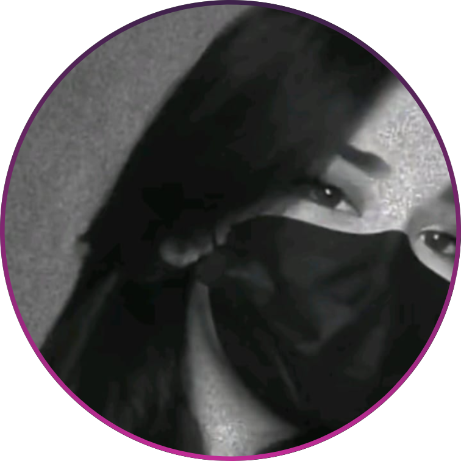
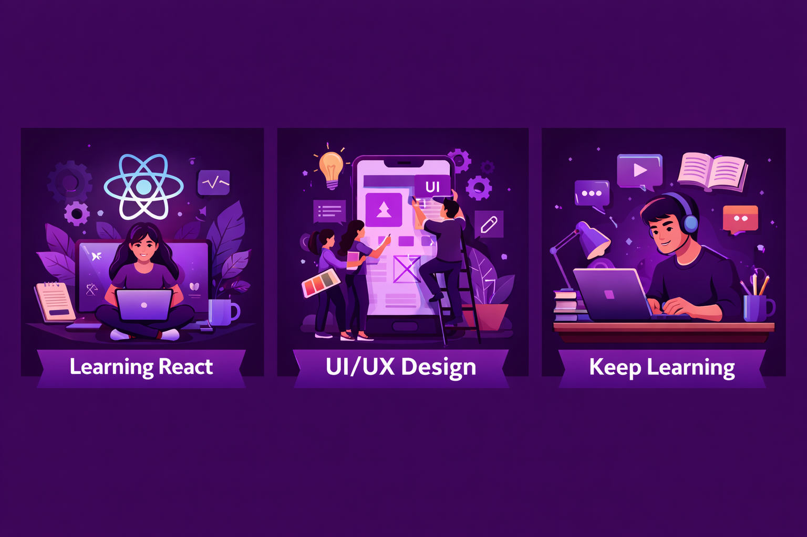

# Hi, I'm Fatima Bashir 👋  

✨ Software Engineering Student | Front-End Web Developer  
💻 React & Next.js Enthusiast | UI/UX Lover  
🎨 Graphic Designer | Passionate about Clean & Engaging Interfaces  
🚀 Building projects, learning continuously, and sharing my journey  

---

## 🌟 About Me

- I build **responsive and user-friendly web apps** with React & Next.js  
- I love turning **designs into functional interfaces**  
- Skilled in **HTML, CSS, JavaScript, Tailwind CSS**  
- Strong background in **graphic design and UI/UX**  
- I believe in **learning by building projects that make an impact**  

---

## 🛠️ Skills & Technologies

<!-- Frontend -->

<!-- Design Tools -->

<!-- Others -->

---

## 📌 Projects
### **Role-Based Team Dashboard (React & Next.js)**
- Role filtering & conditional rendering  
- Dark UI design with responsive layouts  
- Built with React hooks & Next.js routing  

### **Landing Page Designs**
- Fully **responsive and mobile-friendly**  
- Emphasis on **clean UI & modern UX patterns**  

### **Portfolio Website (Next.js & Tailwind CSS)**
- Showcases projects and skills  
- Smooth animations & interactive components  
*(More projects coming soon 🚀)*  

---

## 🌱 Currently Learning
- Advanced **React & Next.js concepts**  
- State management with **Redux & Context API**  
- **UI/UX best practices & accessibility standards**  
- Optimizing **performance for web applications**  

---

## 📫 Connect With Me
  
  

---

⭐ Thanks for visiting my profile! Let’s build something amazing together 🚀
